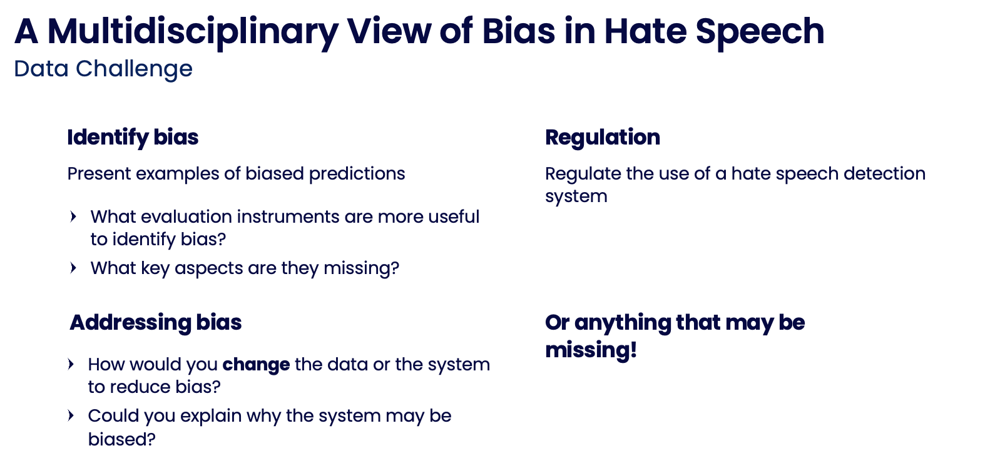

# multidisciplinary-data-challenge

**A [public](https://github.com/nobias-project/multidisciplinary-data-challenge) version of this repository**

This repository contains the data and code of the NoBIAS 2023 Data Challenge. The goal is to set an example and promote multidisciplinary participation in the discourse of technology development to address societal challenges.

In a nutshell, this were the 🗝️ ingredients for the challenge:

* 🔎 Evaluation: Using *informative* metrics to inspect specific model behaviours (e.g., adversarial benchmarks and test suites in the case of 🤬 hate speech detection).
* 📝 Data: include a *rich* set of annotations to enable more nuanced considerations (e.g., the non-aggregated data, demographic information of the annotators, and about the target groups in the hate speech texts).
* 💡 Task: enable *open-ended feedback* to promote the generation of knowledge. The [Figure](challenge/slides/Example_prompts.png) below shows example prompts that were used to spark discussion and critical reflection on bias through this problem-solving scenario.


<p align="center">
 
</p>

## Contents

- The `preparation` folder contains scripts to create the [data](preparation/1_prepare_data.ipynb) and [evaluation files](preparation/2_prepare_evaluation.ipynb). Given the list of submissions, the [evaluation](preparation/3_evaluation.ipynb) notebook computes the challenge results.
- The `challenge` folder includes the resulting files required and supporting to run the challenge (i.e., the folder to share with the participants). These include a slide deck with detailed instructions, motivation, schedule for a one-day session, and a bibliography.

## Outputs

Here we provide more detailed instructions on what outputs each Jupyter Notebook generates: 

- [data](preparation/1_prepare_data.ipynb): generates files for participants to train the models (`challenge/data/[train_aggregate, train].csv`) and the files required to generate the adversarial tests (`preparation/Adversifier/mhs/[aaa_train, aaa_test].csv`, ) 
- [evaluation files](preparation/2_prepare_evaluation.ipynb) is based on Docker, and exports o the evaluation folder to share with participants the TSV static and dynamic files for testing the models (`challenge/eval_files/[corr_a_to_a/corr_n_to_a,f1_o,flip_n_to_a/hashtag_check/quoting_a_to_n/static].tsv`).
- [evaluation](preparation/3_evaluation.ipynb) computes the results once all participants have submitted their predictions to the `preparation/Adversifier/datathon_results/team_{}` folder. The notebook outputs (in `datathon_results/answers` folder) a `results.tsv` file in each individual team folder, and a common `hatecheck.csv` file including each teams predictions as additional columns.

## Requirements

The `challenge` is designed to run in a Google Colab environment. Participants can get started with:

- Part [one](challenge/Challenge_part1.ipynb) in <a target="_blank" href="https://colab.research.google.com/github/preyero/multidisciplinary-data-challenge/blob/master/challenge/Challenge_part1.ipynb">
  
</a>: basic data loading functions and features to get started.
- Part [two](challenge/Challenge_part2.ipynb) in <a target="_blank" href="https://colab.research.google.com/github/preyero/multidisciplinary-data-challenge/blob/master/challenge/Challenge_part2.ipynb">
  
</a>: including a hate speech classifier and evaluation instruments to conduct an example-based analysis of bias in the proposed models.

`Preparation` notebooks and scripts were run in a Conda environment in Python 3.10.

```commandline
    $ conda create --name <env_name> --file conda-file.txt python=3.10
    $ conda activate <env_name>
    # Inside virtual environment to run notebooks with this conda environment
    (<env_name>) $ python -m ipykernel install --user --name=<env_name>
    (<env_name>) $ jupyter notebook
```

## Contact

We published a [paper]() (under review) with the considerations and results from this data challenge.

Reach out if you have any questions [📧 by email]((mailto:paula.reyero-lobo@open.ac.uk)), especially if you are looking to involve multiple disciplines to work ⚙️ hands-on a problem!

```


```